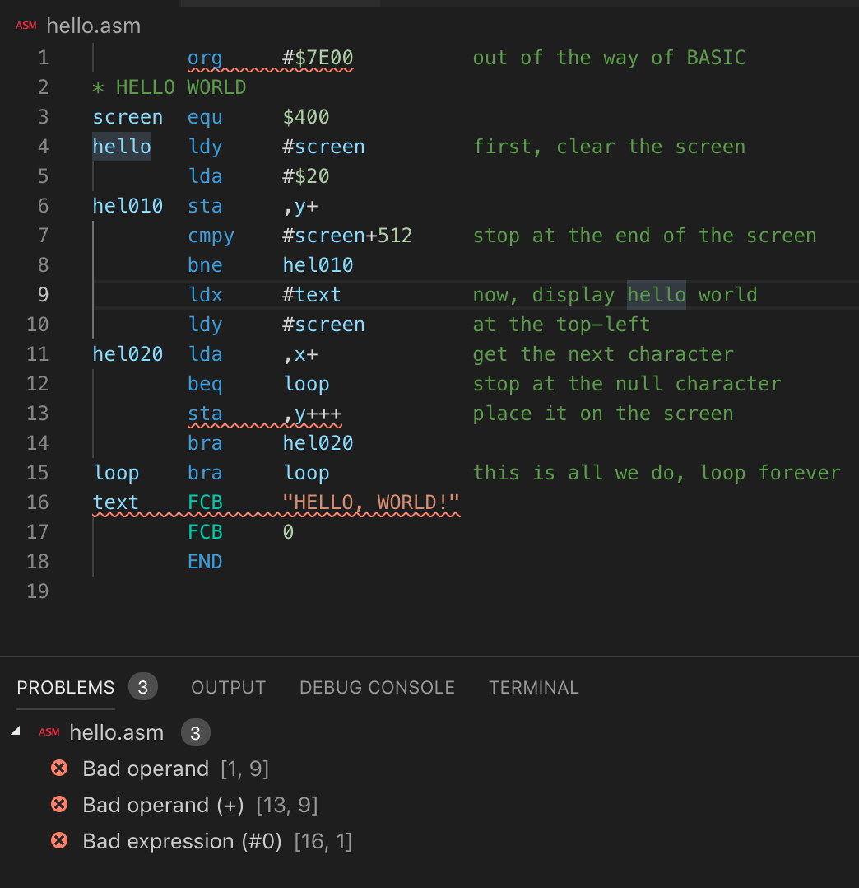
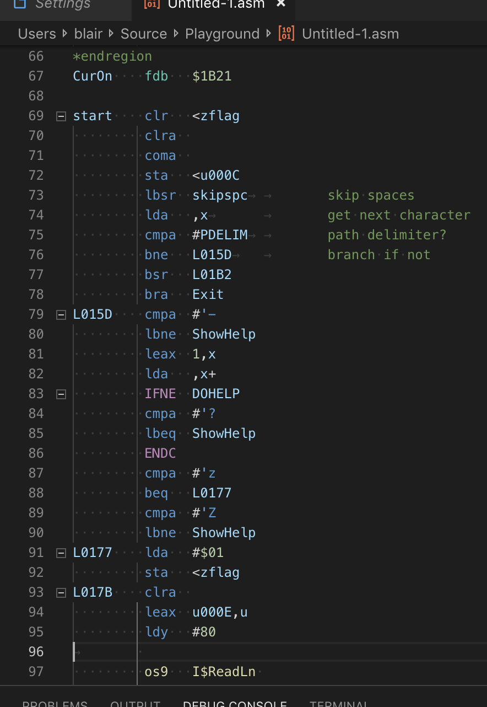
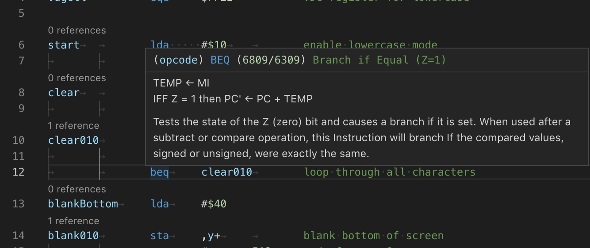
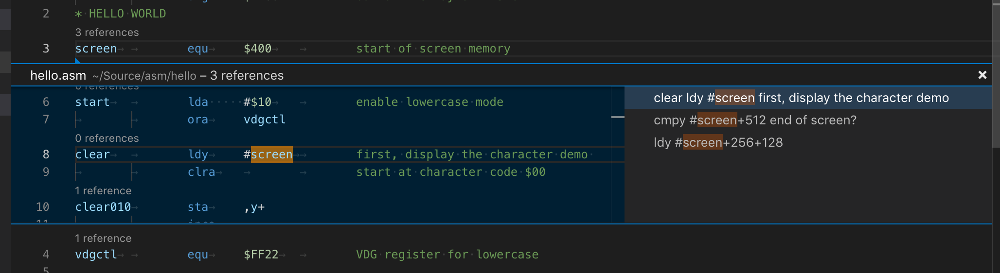
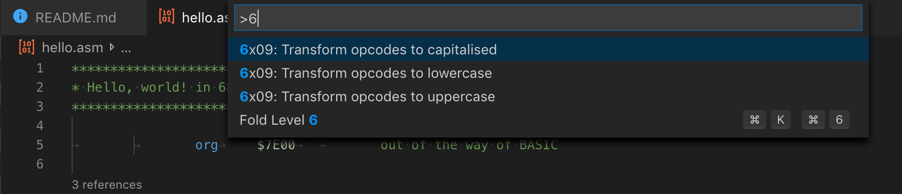

# vscode-6x09-assembly

This is a Visual Studio extension for the 6x09 Assembly language.

This extension supports files with the extensions `.s`, `.asm`, `.d` and `.defs`.

**Enable semantic highlighting for full functionality of this extension.**

## Assembler

This extension is build to work closely with the `lwasm` assembler, part of LWTOOLS,
available at [http://www.lwtools.ca](http://www.lwtools.ca).

## Acknowledgements

- Lee as beta tester

## Feature examples

### Problem metching with `lwasm`

### Op code completion with documentation

### Folding of code blocks

### Hover documentation for op codes

### Code Lens showing number of references for labels

### Commands

